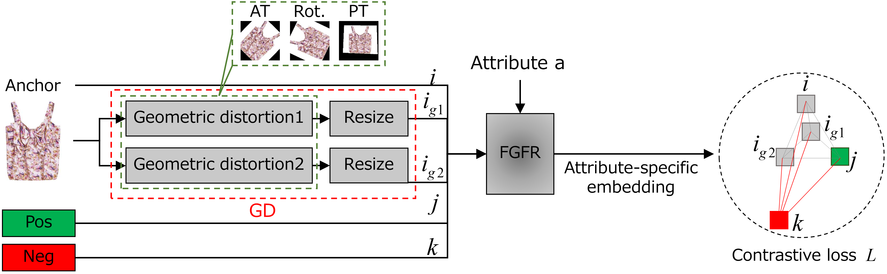

# Toward a More Robust Fine-grained Fashion Retrieval

This repository is a [PyTorch]( https://pytorch.org/ ) implementation of **ASENet_V2+GD** proposed in our paper [*Toward a More Robust Fine-grained Fashion Retrieval*] accepted by MIPR 2023.

## Network



## Requirements

### Environments

* PyTorch 1.1.0
* CUDA 10.1.168
* Python 3.6.2

We use anaconda to create our experimental environment. You can rebuild it by the following commands.

```sh
conda create -n {your_env_name} python=3.6
conda activate {your_env_name}
pip install -r requirements.txt
...
conda deactivate
```

### Download Data

#### Dataset Split

We supply our dataset split and some descriptions of the datasets with a bunch of meta files. Download them by the following script.

```sh
wget -c -P data/ http://www.maryeon.com/file/meta_data.tar.gz
cd data/
tar -zxvf meta_data.tar.gz
```

#### FashionAI Dataset

As the full FashionAI has not been publicly released, we utilize its early version for the [FashionAI Global Challenge 2018](https://tianchi.aliyun.com/markets/tianchi/FashionAI). You can first sign in and download the data. Once done, you should uncompress them into the `FashionAI` directory:

```sh
unzip fashionAI_attributes_train1.zip fashionAI_attributes_train2.zip -d {your_project_path}/data/FashionAI
```

## Getting Started

You can simply train the model on FashionAI dataset(default)

```sh
python main.py
```

there are also optional arguments for dataset, initial learning rate, batch size and so on. Check them by 

```sh
python main.py --help
```

## Testing

As training terminates, two snapshots are saved for testing. One is the model that has the highest performance on validation set and the other is the one of the latest epoch. You can load any of them and test on the test set.

```sh
python main.py --test [--dataset xx] --resume runs/{your_exp_name}/xx.pth.tar
```

## Citing

If it's of any help to your research, consider citing our work:

```latex
@inproceedings{Ling_MIPR2023,
  title={Toward a More Robust Fine-grained Fashion Retrieval},
  author={Ling, Xiao and Xiaofeng, Zhang and Toshihiko Yamasaki},
  booktitle={IEEE International Conference on Multimedia Information Processing and Retrieval(MIPR)},
  year = {2023}
}
```